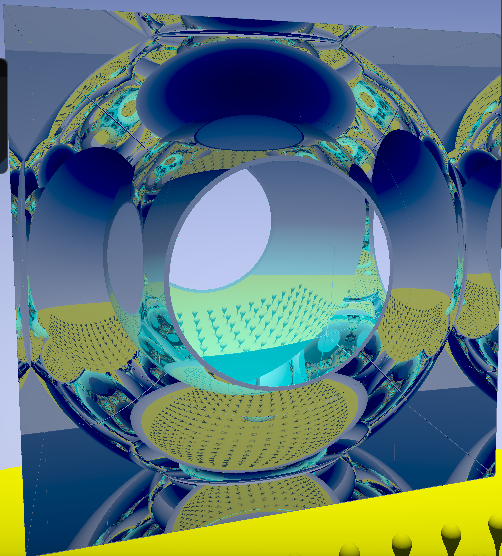

# RayMarching

GPU rendering of SDF CSG trees with shadows, reflections and refraction.

SDF & ray marching resource: https://www.iquilezles.org/www/articles/distfunctions/distfunctions.htm

Optimisations based on https://erleuchtet.org/~cupe/permanent/enhanced_sphere_tracing.pdf :
* Over-relaxation sphere tracing
* Screen-space aware intersection point selection

Custom optimisation of lower resolution marching & then precise marching and shading on full res (green pixels are not calculated on high res unnecessarily:

Examples:

